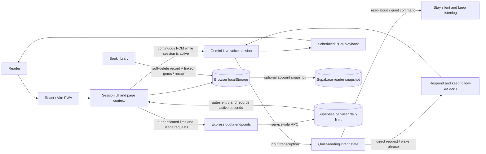

# Reading Companion

A personal reading companion app built with React + Vite on the frontend and a small Node/Express backend for AI session orchestration. Version 2.5.0, **Every Line, Reimagined**, includes Gem Studio alongside Reader Arena, Profile, Help and update-delivery improvements while keeping reader data local-first with optional private per-account cloud snapshots.

## Version 2.5.0: Every Line, Reimagined

- Gem Studio offers 14 quote-card templates, live previews, three aspect ratios and one-tap surprise styling.
- Profile shows a copyable Supabase UID and keeps the reader card visible while its options scroll.
- Reading-limit and access requests launch prefilled email drafts with account context.
- Reader Arena recovers from the Supabase schema-cache issue and provides explicit loading, empty, error and retry states.
- Help & Guide and release alerts explain the updated workflows; deployment pushes are opt-in.

Apply the Arena schema-cache refresh migration after the weekly ranking migration.

## Version 2.4.0: Reader Arena & Honest Eyes

- Reader Arena ranks actual reading time across genres, with weekly and all-time tabs, a Monday-midnight IST weekly reset, and a live Profile rank card.
- Weekly totals begin when the weekly ranking migration is applied; earlier weekly time cannot be recovered from the daily allowance records.
- Before using a new page photo, the app checks whether it shows book text. Unrelated and unreadable photos are blocked; if the check is unavailable, the photo remains unverified and is not sent to the reading model.
- Empty placeholder chapters are explicitly marked as unknown, and the companion is instructed to answer only from the reader’s words, saved context, or verified page transcription.
- The profile and Arena are designed for both themes, touch and keyboard navigation, and reduced-motion preferences.
- Reader Arena retries ranking errors, and Profile shows a copyable account UID while its reader card stays visible during scrolling.
- Documentation access and reading-limit requests open pre-filled email drafts; reading limits are managed directly in Supabase.
- Gem downloads include 14 templates, three aspect ratios, color accents and live quote previews.
- Readers who opt in to app announcements can receive a push notification after a successful production deployment.
- Reader Arena adapts to small rosters, shows privately shared profile photos, supports photo opt-out, and keeps the own-place summary pinned above navigation.
- Arena photo storage uses a private Supabase bucket; apply [the Arena avatar migration](supabase/migrations/20261017130000_add_reader_arena_avatars.sql) before deploying this release.

Apply [the account reading-limit migration](supabase/migrations/20261014120000_add_account_reading_limits.sql), [the all-time ranking migration](supabase/migrations/20261015120000_add_reader_rankings.sql), [the weekly Arena migration](supabase/migrations/20261016120000_add_reader_arena_weekly_rankings.sql), and [the Arena schema-cache refresh](supabase/migrations/20261017120000_reload_reader_arena_rpc_schema.sql) before deploying. `READING_VERIFY_MODEL` is optional and defaults to `READING_TEXT_MODEL`.

See [the page-grounding red-team checklist](docs/grounding-redteam.md) for the manual photo and hallucination checks.

## Version 2.3.0: The Storykeeper’s Lantern

- An account-scoped daily reading allowance (30 minutes by default), tracked in Supabase across devices, with a clear limit notice and a developer email link.
- A recoverable Deleted books bin. Restore a book with its chapters, linked gems and conversation recap, or permanently erase the archived data.
- Unique, cover-art-free book tiles use the title entered by the reader and open across the whole tile while preserving separate Author, Play and Delete actions.
- The reading-session microphone stream remains open after the welcome; the companion is instructed to stay quiet during reading and respond to direct questions, greetings or its name.
- Help & Guide explains the snapshot-only workflow, continuous listening, account reading allowance and book recovery, with matching animations.
- Updated engineering documentation and the session/data flow diagram below.

### Reading session and data architecture



The microphone remains captured locally and PCM audio is sent to the Live session while the reader is actively in the foreground session. Live input transcription updates a quiet-reading state for explicit phrases such as “I’m going to read”; the model is instructed not to answer read-aloud text and to resume on direct requests, greetings or the companion name. The session still depends on the browser, network and Gemini service, and continuous streaming can use more battery than tap-to-ask. Audio playback schedules PCM chunks against the Web Audio clock to preserve chunk ordering.

Book deletion is a soft delete: the book record stores its archived related gems and conversation recap, while active Library and Mind Map views stop exposing them. Restore rehydrates those records; permanent deletion removes the archived book record and its embedded relationships. Reading limits and active usage are stored per Supabase user in `reading_companion_session_limits`; server-side RPCs reset usage on the UTC date boundary and atomically cap recorded seconds. The frontend batches short usage increments and keeps unsubmitted seconds scoped to the signed-in account for recovery after a reload.

Reader ranking compares accepted active reading seconds across every genre. The authenticated leaderboard displays each reader's profile name and reading time; weekly aggregation begins when the weekly Arena migration is applied, so earlier weekly time cannot be backfilled. The server associates totals with Supabase user IDs but does not return other readers' IDs to the client. Deleting the account snapshot also clears that reader's ranking totals.

Apply [the account reading-limit migration](supabase/migrations/20261014120000_add_account_reading_limits.sql) and [the reader-ranking migration](supabase/migrations/20261015120000_add_reader_rankings.sql) before deploying this version. Reading limits are viewed in Settings and changed directly in Supabase; never expose the Supabase service-role key to the frontend.

The app can request a screen wake lock only while the reading screen is visible and the browser supports it. Browsers may suspend microphone access and timers in the background or when the phone is locked; local audio processing, continuous streaming and a lit screen can still warm a phone. Neither uninterrupted lock-screen listening nor zero device heat can be guaranteed by a web app.

## Version 2.1.0

- Push notifications for app updates and announcements, plus opt-in smart study reminders learned from your reading times.
- Redesigned report status timeline with a tick for completed stages, a single latest note per stage and fixed-in versions that link to Release History.
- Back navigation moves exactly one level up from nested screens, sheets and dialogs.
- Chapter vocabulary lists scroll again.
- Help & Support shows live AI availability with a friendly notice, opens with the message box ready and keeps it above the keyboard.
- Gem details scroll fully, Mind Map echo lines are back, and Ghost Mode switches on quietly.
- Help chat shows dedicated animations for every feature, with a compact status pill, tidy toolbar and a plain Send button.
- Push notification when the status of an issue you reported changes (needs the Supabase webhook below).
- Distinct gem card colours, circular Profile dock icon, working Mind Map full screen, grey Done step until completed, and Your Reports no longer shows other people's reports.

### Push notification setup

1. Apply [the push subscription migration](supabase/migrations/20261011120000_create_push_subscriptions.sql) and [the status-note dedupe migration](supabase/migrations/20261010120000_dedupe_bug_report_status_notes.sql).
2. Generate keys with `npm run push:keys -w backend` and set `VAPID_PUBLIC_KEY`, `VAPID_PRIVATE_KEY` and `VAPID_SUBJECT` on the backend. Set `ADMIN_TOKEN` too.
3. Send an announcement with `npm run push:send -w backend -- --title "New update" --body "Version 2.1.0 is live" --url /`, or `POST /api/push/send` with the `x-admin-token` header and a `{ "title", "body", "url" }` body.
  Successful production deployments from `main` are announced by [the GitHub Actions workflow](.github/workflows/announce-production-deploy.yml). Configure the same backend `ADMIN_TOKEN` as a GitHub Actions repository secret named `ADMIN_TOKEN`, and make sure the hosting integration emits successful production deployment-status events. Broadcasts go only to devices that enabled **App updates & announcements**.
4. Study reminders are checked every 5 minutes while the backend is awake. On hosts that sleep, schedule an external cron to `POST /api/push/reminders/run` with `x-admin-token` every 5–10 minutes.

5. Report-status pushes: apply [the push endpoint migration](supabase/migrations/20261012120000_add_bug_report_push_endpoint.sql), then in Supabase go to Database, Webhooks, create one on `bug_reports` for UPDATE that POSTs to `https://<backend>/api/push/report-status` with the header `x-admin-token`.

Notifications require the installed or production build; the development server does not register the service worker.

## Version 2.0.0: A New Chapter

- Google sign-in, account-scoped cloud snapshots, conflict resolution and a dedicated Account screen.
- Full-screen Help & Support with streamed replies, built-in guide answers, animated explainers and direct navigation.
- Visible New chat, Chat history and App tour controls; searchable, date-grouped history with mobile bottom-sheet presentation, read-only saved conversations and confirmed deletion.
- A resumable bilingual app tour, clearer onboarding, vocabulary practice and pronunciation observations.
- Cross-book Mind Map connections, improved Gems and memories, safer voice-requested deletion and more resilient reading sessions.
- Report-description and reproduction-step polishing, plus refreshed version-2 release presentation.

Help conversations remain on the current device and are excluded from cloud backups.
See [the release notes](frontend/public/release-notes.json) for the full release.

### Release configuration

Before promoting `dev` to `main`:

1. Apply [the reader-account migration](supabase/migrations/20261004210000_create_reader_cloud_accounts.sql) to the intended Supabase environment. It enables per-user row-level policies on reading snapshots.
2. Enable Google authentication in Supabase and configure the appropriate local, preview and production redirect URLs.
3. Configure `VITE_SUPABASE_URL` and `VITE_SUPABASE_ANON_KEY` in the frontend environment. Keep service-role credentials server-side.
4. Configure the optional server-only `GROQ_API_KEY` for Help replies and Cloudflare credentials for backup replies and report rewrites. Built-in Help answers remain available when AI replies are unavailable.
5. Deploy the matching backend and frontend. The backend Help route imports the guide from the frontend source, so retain that source in the backend deployment checkout.
6. Keep the in-memory Gemini key/lease pool on one backend instance unless shared state is introduced. Optional pool limits and the protected diagnostic endpoint are described in [the backend environment template](backend/.env.example).

### Unreleased: snapshot-first reading

Snapshot-first reading is the default: one locally saved page photo, a local mic gate with 700 ms of pre-roll, and explicit turn boundaries (a pause does not end Tap to ask). The voice session gives a short spoken introduction once its initial context is ready, warms its Live connection at startup, and keeps it available for up to 10 minutes between questions; later questions reconnect and resend the page context. On browsers that support forced on-device speech recognition, the saved companion name or a greeting wakes the assistant locally. A spoken "I'm reading" / "don't interrupt" command returns it to quiet standby, and natural follow-ups remain open for 8 seconds. Browsers without local recognition use local VAD to detect speech and the server-side audio classifier to decide whether to respond. The browser requests a screen wake lock during an active, visible reading session where supported; voice is not guaranteed to continue when the phone is locked or the browser is backgrounded. The wake lock keeps the display on and can increase battery use. Local microphone capture/VAD and a lit screen can still warm a phone, so zero heat cannot be guaranteed. To roll back to continuous camera/audio streaming, set the public build flag `VITE_SESSION_STREAMING_LEGACY=true` and rebuild the frontend. The rate-limited typed reading fallback uses server-side Gemini with the optional `READING_TEXT_MODEL` override (default `gemini-3.5-flash-lite`); no extra API key is required. Hands-free VAD assets are self-hosted and loaded only by the automatic-classification fallback.

Never commit local environment files or credentials.

## Historical local-only deployment guide

The sections below describe the earlier local-only architecture and alternative hosting approaches. Their statements about having no account or cloud database do **not** describe the 2.0.0 account-backed release; use the configuration checklist above for the current application.

This guide explains the right way to deploy it for daily personal use, how to keep your data local, and how to install it on your phone like a normal app without writing Android code.

Important note before deployment:

- This app is not a cloud database app. It is designed to keep reading data on the device where it is used.
- The AI functions still depend on external services like Gemini and Cloudflare image generation. Those are API calls, not database storage.
- If you want 100% no-cloud-data-storage, the correct approach is: keep the app data in the browser local storage, never store it in any backend database, and never sync it to a cloud DB.
- If you want a true app-like experience on your phone without Android programming, the right approach is a Progressive Web App (PWA). This gives you an installed app icon and full-screen experience, but it is still a web app.

---

## 1) What this app actually does

This project has two layers:

1. Frontend:
   - React app
   - UI for library, sessions, gems, memory, profile
   - local data storage in browser storage

2. Backend:
   - Express server for AI calls, session work, and API endpoints
   - can call Gemini live models and Cloudflare image generation

The app keeps most user data in browser memory/storage. That means:

- books are stored on the device you are using
- chapters and vocab are stored on the device
- gems and memories are stored on the device
- no separate cloud database is required for normal usage

This is exactly the right direction if your requirement is: "I want it on my phone, I want it to feel like an app, and I do not want my notes to live in a cloud database."

---

## 2) The correct mental model

There are 3 common ways people think about this:

### Option A: Fully local-only app

- frontend served from your own home machine or local server
- backend served from the same machine or a local machine on your LAN
- all storage stays in the browser local storage on the phone
- no cloud database
- no public deployment needed

This is the best fit if you want zero cloud data storage.

### Option B: Free hosted frontend + local-only data

- frontend hosted on Vercel / Netlify / Cloudflare Pages
- backend either:
  - hosted on a small free service
  - or kept on your home computer
- data still stays local in browser storage
- this works well for convenience, but the app is still reliant on remote AI APIs

This is a good compromise if you want a simple public URL and app-like install.

### Option C: Native Android app

- requires Android Studio, Java/Kotlin, or Capacitor/React Native wrappers
- not needed for this requirement
- not the simplest path if you want zero Android code

For your case, the best answer is: use a PWA, not Android programming.

---

## 3) What is a PWA and why it is the right choice

A Progressive Web App is a website that acts like an app.

It can:

- be installed on Android home screen
- open in full-screen mode
- look and feel like a normal app
- work with browser-local storage
- run without a native Android project

This project already includes a PWA-style manifest file in `frontend/public/manifest.json`, which is important because it tells the browser that the app can be installed.

The phone will not treat it as a native Android app, but it will feel like one in daily use.

This is the correct approach for your requirement.

---

## 4) Important reality check: AI features still need external APIs

Even if your data stays local, this app still needs external services for some features:

- Gemini (for live reading sessions)
- Cloudflare image generation endpoint

That means:

- the app can be local-data-only
- but the AI model calls are not local-only unless you run your own model locally

So the right statement is:

> The app data can stay local; the AI model inference can still happen through cloud APIs if you choose that configuration.

This is different from saying "all of the app is fully local and cloud-free".

If you want absolutely zero cloud dependence for AI, then you would need to replace Gemini and Cloudflare calls with a locally running model (for example, on your own PC or a local edge device). That is a different architecture and not what this repo currently does out of the box.

For your described use case, the realistic solution is:

- local data = yes
- cloud AI = maybe yes, unless you intentionally replace it with local model hosting

---

## 5) The simplest setup for your personal daily use

If your goal is:

- use it on my phone every day
- no VS Code open every time
- no Android coding
- data should stay on device

then the simplest real-world path is:

1. Host the frontend on a free static host or your own home server
2. Keep the backend on a machine that stays on at home, or move it to a cheap free hosting service
3. Install the app as a PWA on your phone using the browser's Add to Home Screen option
4. Keep all user data in browser local storage

This gives you an app-like experience without writing Android code.

---

## 6) Deployment option 1: Free hosting with Vercel or Netlify

This is the easiest path if you want to avoid running VS Code on your local machine.

### What is hosted where?

The frontend is a web app and can be deployed to Vercel or Netlify as a static site.

The backend is a Node app and needs a runtime environment. Vercel and Netlify can host serverless functions, but this project is a full Express server. It is easier to do one of these:

- keep the backend on a home PC / Raspberry Pi / local server
- or move it to Render / Railway / Fly.io / Vercel serverless (more setup)

### Best practical setup for this repo

Use this structure:

- Frontend: Vercel or Netlify
- Backend: home server or cheap Node hosting
- Data: browser localStorage on phone

This gives you a real app-like experience while keeping the actual book data local to the device.

### Step-by-step for Vercel

#### Step 1: Install Node and Git

Install:

- Node.js LTS
- Git
- a GitHub account

#### Step 2: Fork or clone the project

```bash
git clone <your-repository-url>
cd Reading Companion
```

#### Step 3: Install dependencies

From the project root:

```bash
npm install
```

Then build frontend once to check everything is correct:

```bash
npm run build -w frontend
```

If that succeeds, the frontend is okay to deploy.

#### Step 4: Prepare the frontend for deployment

The frontend is in the `frontend` folder.

The `vite` project is already set up to build production files.

To deploy it on Vercel:

- Import the project into Vercel
- Set the project root to the repository root or to the `frontend` folder depending on how your repo is configured
- Build command: `npm run build -w frontend`
- Output directory: `frontend/dist`

If Vercel is not configured to work with workspaces, the easiest method is:

- create a separate deployment folder
- or deploy from the `frontend` directory as a standalone Vite app

#### Step 5: Handle API calls

This app expects a backend at runtime. The frontend fetches endpoints like:

- `/api/sketch-gem`
- `/api/compact-session`

Those are server endpoints defined in the Express backend.

So for Vercel deployment, you must either:

- deploy a backend separately and point the frontend to that API URL
- or use Vercel serverless functions to re-create the same routes

If you are keeping this app simple and personal, the easier option is: host the backend on a home server instead of trying to make Vercel replace the Express server.

#### Step 6: Set environment variables

Your backend likely needs:

- Gemini API key
- Cloudflare/other image service keys

Create a `.env` file in the backend and add:

```env
GEMINI_API_KEY=your_key_here
CLOUDFLARE_API_TOKEN=your_token_here
```

Then start the backend with:

```bash
cd backend
npm install
node server.js
```

---

## 7) Deployment option 2: Deploy only the frontend to free static hosting

This is good when:

- you only want the app shell live
- the backend remains on your own machine at home

### Example setup

- frontend on Vercel or Netlify
- backend on your home PC, Raspberry Pi, or a small always-on local machine

Then on the phone:

- open the deployed frontend URL
- install it as an app
- the app calls your home server over the internet only if your home machine is exposed publicly

Important: if your backend is only on your home Wi-Fi, then it will not be reachable from outside your network unless you configure port forwarding or a reverse proxy.

This is okay for a private personal app if you are okay with local-network-only access.

---

## 8) The best no-cloud approach for your personal life

If you truly want to avoid cloud hosting completely, do this:

### Setup A: Home-hosted app

Use a small machine at home:

- Raspberry Pi
- old laptop
- mini PC
- old desktop

Run:

- frontend via a local web server
- backend via Node Express

Then on your phone:

- connect to your home Wi-Fi
- open the local URL (for example `https://reading-companion.local` or `https://192.168.1.20`)
- tap Add to Home Screen
- use it like a normal app

This keeps:

- app data in browser local storage on the phone
- all user data local to the device
- no cloud database
- no third-party backend storage

This is probably the cleanest answer to your requirement.

### How to make it work on your phone without a public URL

On Android, the easiest route is:

1. run the app on your home machine or local server
2. connect your phone to the same Wi-Fi network
3. open `https://your-home-ip:PORT` or a local domain name
4. use the browser's "Add to Home Screen" option
5. the app opens in its own standalone window

This does not require Android app code.

### If you want it accessible outside your home network

Then you need:

- a public domain and HTTPS cert
- or a reverse proxy like Nginx
- or a tunnel service like Cloudflare Tunnel / Tailscale / ngrok

But this is not needed if your only requirement is personal daily use at home.

---

## 9) Recommended setup for your exact case

For your requirement, I would suggest this exact structure:

### Best practical personal setup

- Frontend: static host or local home server
- Backend: local home server running Express
- Data: browser localStorage on the device
- Phone install: PWA from browser "Add to Home Screen"
- AI API: Gemini or your preferred model API
- Images: Cloudflare generation only if needed

Use this if you want to avoid cloud data storage and still get the AI features.

### Why this is the right answer

Because:

- the app is browser-based
- the data is stored in local browser storage
- the phone can install it like an app
- you do not need Android Studio or Kotlin
- you do not need a cloud database unless you choose to add one

---

## 10) Step-by-step: run it locally on your own machine

This is the simplest method for everyday usage.

### Step 1: Install dependencies

At the project root:

```bash
npm install
```

### Step 2: Start the backend

```bash
cd backend
npm install
node server.js
```

The backend will run on a local port, typically 8787 or whatever is configured in the code.

### Step 3: Start the frontend

In a second terminal:

```bash
cd frontend
npm install
npm run dev -- --host 0.0.0.0
```

This makes the frontend available on your local network.

### Step 4: Open it in the browser on your phone

On your phone connected to the same Wi-Fi network, open:

```text
http://YOUR_COMPUTER_IP:5173
```

or the host URL if Vite is configured for a custom port.

### Step 5: Install it as an app

In Chrome or Edge on Android:

- open the site
- tap the menu button
- choose "Add to Home screen" or "Install app"
- confirm

Now it behaves like a normal app icon on your home screen.

### Step 6: Keep your data local

Because the app uses browser storage, your books, memories, gems, and vocabulary stay in the browser on that device.

No server-side database is needed for day-to-day use.

---

## 11) Step-by-step: run it via a custom local HTTPS server

If you want it to behave more like a real app and avoid browser restrictions, run it via HTTPS on your local network.

### Option 1: Use a local reverse proxy

Use a tool like Nginx or Caddy to serve the frontend and proxy API calls to the backend.

Example idea:

- `https://reading-companion.local` points to the frontend
- `/api/*` is proxied to the Express backend

This is a clean setup for home use.

### Option 2: Use mkcert for local HTTPS

If you do not want a public domain, you can generate a local certificate for your home network.

Example:

```bash
mkcert -install
mkcert localhost 127.0.0.1 192.168.1.20
```

Then serve the app with SSL locally.

This helps because some browsers are stricter about PWA installs when the site is not HTTPS.

---

## 12) Step-by-step: host the frontend on Vercel, keep backend local

This is often the easiest hybrid approach.

### Step 1: Deploy the frontend to Vercel

- push the repo to GitHub
- import it in Vercel
- set the frontend as the root app or project folder
- build command: `npm run build -w frontend`
- output directory: `frontend/dist`

### Step 2: Keep backend local

Run the backend on your own machine at home:

```bash
cd backend
node server.js
```

### Step 3: Point the frontend at the backend

If the frontend is using a hardcoded API hostname, update it to your backend URL.

If the app uses a relative path such as `/api/...`, then serve the backend behind the same domain or proxy it.

### Step 4: Install the app on the phone

Open the deployed frontend in Chrome and select Add to Home Screen.

Now it behaves like a phone app, while your data stays local on the device.

---

## 13) What not to do if your goal is local-only data

Avoid these if you want to keep data local and personal:

- Do not add a cloud database like MongoDB Atlas, Firebase, Supabase, or Azure SQL unless you explicitly want sync across devices
- Do not upload your book library to a hosted DB
- Do not make the backend store user data in a remote database
- Do not build a cloud sync layer if your goal is privacy and local-only usage

If you do those things, then your app becomes a cloud-backed app, and that is a different system design.

---

## 14) If you want the phone app to work without a browser URL

This is an important distinction:

### You cannot get a truly native Android app without Android tooling or a wrapper

But you can still get a near-native experience with a PWA:

- add it to home screen
- full-screen mode
- app icon
- app-like UX
- no Android programming required

That is the correct answer for your use case.

If you insist on a native binary without web tech, then you would need:

- Capacitor
- or Android Studio with Java/Kotlin
- or a wrapper tool that converts the web app into an APK/AAB

But this is not necessary for your requirement.

---

## 15) The recommended final approach for your use case

If I were building this for daily personal use, I would do exactly this:

1. Keep the frontend as a web app
2. Keep the app data in browser local storage on the device
3. Install it as a PWA on the phone
4. Run the backend locally or on a private home server
5. Use Gemini/API endpoints only when the user requests AI features
6. Avoid any cloud database or remote sync

This is the most realistic and simplest path to get:

- phone app feel
- private local data
- no Android programming
- no VS Code needed every time

---

## 16) One practical recommendation

If you do not want any public cloud exposure at all, the cleanest setup is:

- run the whole app locally at home
- connect the phone on your same Wi-Fi
- install via Add to Home Screen
- let all storage remain in the browser

This is effectively a private personal app, not a public SaaS app.

This matches your requirement better than Vercel because Vercel is not needed for a private app you use daily at home.

---

## 17) Quick summary

### If you want the simplest setup:

- use local browser storage
- run backend locally
- install the frontend as a PWA on your phone

### If you want a hosted but still personal setup:

- deploy the frontend to Vercel/Netlify
- keep the backend on a home machine or small Node host
- install the site on the phone as a PWA

### If you want absolutely no cloud data storage:

- do not use a cloud database
- keep all data in browser local storage
- use local hosting or home Wi-Fi networking

---

## 18) Final recommendation

Your thought direction is mostly correct, but the important correction is this:

- The app can absolutely feel like a normal app on a phone
- The app data can absolutely stay local
- But the AI backend is still a separate cloud/API concern unless you run a local model yourself
- The correct app packaging for no Android programming is PWA, not native Android

So the best answer for you is:

> Use a PWA installed on your phone, keep the app data local in the browser, and optionally host the backend locally or privately. Do not add any cloud database if your goal is local-only usage.

---

## 19) Commands to remember

Frontend build:

```bash
npm run build -w frontend
```

Backend run locally:

```bash
cd backend
node server.js
```

Frontend run locally:

```bash
cd frontend
npm run dev -- --host 0.0.0.0
```

---

## 20) Suggested next step

If you want, the next best step is to make this app easier to deploy as a true PWA by doing the following:

1. make sure the manifest includes valid icons
2. add a service worker for offline caching
3. make sure the app works with a stable base URL
4. make the backend API base configurable
5. add a home-server deployment script

That would make it much easier to install on a phone and use daily without opening VS Code or the dev URL.
